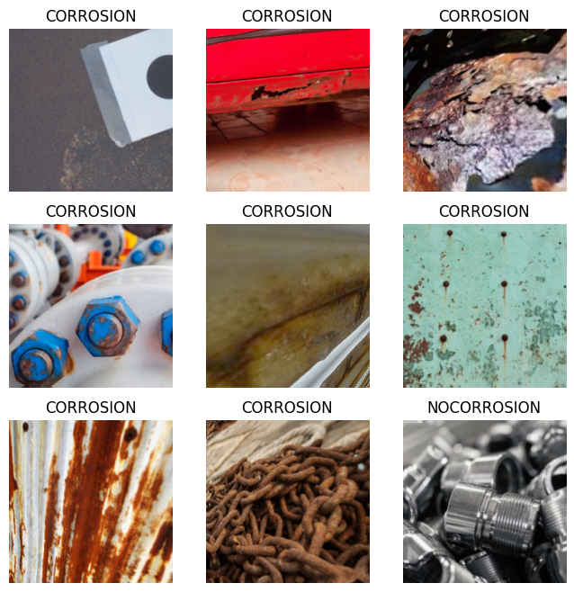
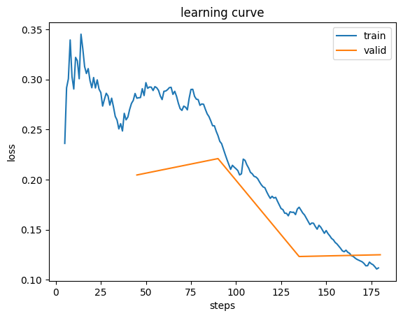
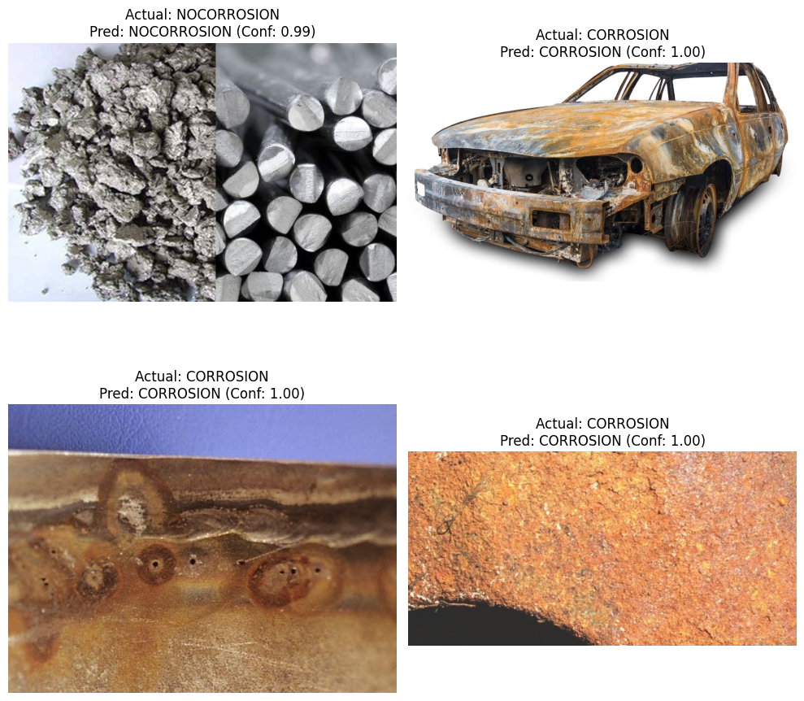

# Corrosion Detection


<!-- WARNING: THIS FILE WAS AUTOGENERATED! DO NOT EDIT! -->

``` python
!git clone https://github.com/pjsun2012/Phase5_Capstone-Project.git
```

``` python
!pip install fastai
```

\##imorting the necessary libraries

``` python
from fastai.vision.all import *
```

## Define data path

Set the path to the dataset, which is ‘Phase5_Capstone-Project/data’,
containing the ‘CORROSION’ and ‘NOCORROSION’ subfolders.

``` python
path = Path('Data/data')
```

## Prepare data with DataLoaders

**bold text** Load the images from the ‘CORROSION’ and ‘NOCORROSION’
folders, apply appropriate data augmentations and transformations (e.g.,
resizing, normalization), and create `DataLoaders` for training and
validation.

``` python
size = 224
bs = 32

dls = ImageDataLoaders.from_folder(path, valid_pct=0.2, seed=42,
    item_tfms=Resize(size),
    batch_tfms=aug_transforms(mult=2) + [Normalize.from_stats(*imagenet_stats)],
    bs=bs)

print("DataLoaders created with training and validation sets.")
print(f"Number of training items: {len(dls.train_ds)}")
print(f"Number of validation items: {len(dls.valid_ds)}")

dls.show_batch(max_n=9, figsize=(8,8))
```

    DataLoaders created with training and validation sets.
    Number of training items: 1456
    Number of validation items: 363



## Initialize Learner with ResNet34

Create a `cnn_learner` using the prepared `DataLoaders`, the `resnet34`
architecture as the backbone, and define metrics as `accuracy` for
evaluating the model’s performance.

``` python
learn = vision_learner(dls, resnet34, metrics=accuracy)
print("Learner initialized with resnet34 and accuracy metric.")
```

    Learner initialized with resnet34 and accuracy metric.

``` python
learn.fine_tune(4)
print("Model training completed for 4 epochs.")
```

<style>
    progress { appearance: none; border: none; border-radius: 4px; width: 300px;
        height: 20px; vertical-align: middle; background: #e0e0e0; }
&#10;    progress::-webkit-progress-bar { background: #e0e0e0; border-radius: 4px; }
    progress::-webkit-progress-value { background: #2196F3; border-radius: 4px; }
    progress::-moz-progress-bar { background: #2196F3; border-radius: 4px; }
&#10;    progress:not([value]) {
        background: repeating-linear-gradient(45deg, #7e7e7e, #7e7e7e 10px, #5c5c5c 10px, #5c5c5c 20px); }
&#10;    progress.progress-bar-interrupted::-webkit-progress-value { background: #F44336; }
    progress.progress-bar-interrupted::-moz-progress-value { background: #F44336; }
    progress.progress-bar-interrupted::-webkit-progress-bar { background: #F44336; }
    progress.progress-bar-interrupted::-moz-progress-bar { background: #F44336; }
    progress.progress-bar-interrupted { background: #F44336; }    
&#10;    table.fastprogress { border-collapse: collapse; margin: 1em 0; font-size: 0.9em; }
    table.fastprogress th, table.fastprogress td { padding: 8px 12px; border: 1px solid #ddd; text-align: left; }
    table.fastprogress thead tr { background: #f8f9fa; font-weight: bold; }
    table.fastprogress tbody tr:nth-of-type(even) { background: #f8f9fa; }
</style>

``` html
<div>
  <table class="fastprogress">
    <thead>
      <tr>
        <th>epoch</th>
        <th>train_loss</th>
        <th>valid_loss</th>
        <th>accuracy</th>
        <th>time</th>
      </tr>
    </thead>
    <tbody>
      <tr>
        <td>0</td>
        <td>0.593704</td>
        <td>0.269474</td>
        <td>0.925620</td>
        <td>06:18</td>
      </tr>
    </tbody>
  </table>
</div>
```

``` html
<div>
  <table class="fastprogress">
    <thead>
      <tr>
        <th>epoch</th>
        <th>train_loss</th>
        <th>valid_loss</th>
        <th>accuracy</th>
        <th>time</th>
      </tr>
    </thead>
    <tbody>
      <tr>
        <td>0</td>
        <td>0.286005</td>
        <td>0.204621</td>
        <td>0.939394</td>
        <td>09:25</td>
      </tr>
      <tr>
        <td>1</td>
        <td>0.248296</td>
        <td>0.220989</td>
        <td>0.942149</td>
        <td>09:19</td>
      </tr>
      <tr>
        <td>2</td>
        <td>0.170603</td>
        <td>0.123218</td>
        <td>0.958678</td>
        <td>09:11</td>
      </tr>
      <tr>
        <td>3</td>
        <td>0.111802</td>
        <td>0.124969</td>
        <td>0.961433</td>
        <td>08:56</td>
      </tr>
    </tbody>
  </table>
</div>
```

    Model training completed for 4 epochs.

Initial Epoch (before fine-tuning): So there was this initial epoch (0)
where the train_loss hit 0.593704 and valid_loss was 0.269474, with
accuracy at 0.925620 (92.56%). That’s basically what the model looked
like before we ran the fine_tune method to adjust learning rates and
unfreeze layers.

Fine-tuning Epochs (0-3):

Losses: The train_loss and valid_loss both dropped pretty consistently
over those 4 epochs. Train_loss went from 0.286 down to 0.112, and
valid_loss fell from 0.204 to 0.125. So the model was definitely
learning and getting better at fitting both the training data and the
validation data.

Accuracy: Validation accuracy climbed steadily — started at 93.94% in
the first epoch and ended up at 96.14% by epoch 4. That’s a solid
improvement, and it shows the model’s actually getting better at
classifying the corrosion images.

Generalization: The valid_loss and train_loss stayed pretty close to
each other throughout, which is a good sign that the model wasn’t
overfitting. There was a slight uptick in valid_loss at epoch 3 compared
to epoch 2 (0.124969 vs 0.123218) while train_loss kept dropping —
that’s something to keep an eye on — but overall the trend looks really
good.

Time: Each epoch took around 9 minutes to run.

``` python
learn.recorder.plot_loss()
```



The plot above visualizes the training and validation loss over the
epochs. To see the specific metrics for each epoch, including accuracy,
we can display the recorded metrics directly.

``` python
from ipywidgets import FileUpload
from IPython.display import display
import io

def upload_and_predict():
    uploader = FileUpload(accept='image/*', multiple=False)
    print("Please upload an image for prediction:")
    display(uploader)

    def on_upload_change(change):
        if uploader.value:
            uploaded_file = next(iter(uploader.value.values()))
            content = uploaded_file['content']
            img_bytes = io.BytesIO(content)
            img = PILImage.create(img_bytes)

            # Make prediction
            pred, pred_idx, probs = learn.predict(img)

            print(f"\nPrediction: {pred}")
            print(f"Probability of '{learn.dls.vocab[0]}': {probs[0]:.4f}")
            print(f"Probability of '{learn.dls.vocab[1]}': {probs[1]:.4f}")

            # Display the uploaded image
            display(img)

    uploader.observe(on_upload_change, names='value')

upload_and_predict()
```

    Please upload an image for prediction:

    FileUpload(value={}, accept='image/*', description='Upload')

``` python
preds, targets = learn.get_preds(ds_idx=1)
print("Predictions and actual labels obtained for the validation set.")
print(f"Shape of predictions: {preds.shape}")
print(f"Shape of actual labels: {targets.shape}")
```

    Predictions and actual labels obtained for the validation set.
    Shape of predictions: torch.Size([363, 2])
    Shape of actual labels: torch.Size([363])

``` python
import random
import matplotlib.pyplot as plt

n_samples = 4

# Get indices of some random samples from the validation set
sample_indices = random.sample(range(len(dls.valid_ds)), n_samples)

print(f"Displaying {n_samples} random samples from the validation set:")

plt.figure(figsize=(10, 10))
for i, idx in enumerate(sample_indices):
    img, actual_label_idx = dls.valid_ds[idx]
    actual_label = dls.vocab[actual_label_idx]

    # Get predicted label and confidence from 'preds' tensor
    predicted_probs = preds[idx]
    predicted_label_idx = predicted_probs.argmax().item()
    predicted_label = dls.vocab[predicted_label_idx]
    confidence = predicted_probs[predicted_label_idx].item()

    plt.subplot(2, 2, i + 1)
    img.show(ctx=plt.gca(), title=f'Actual: {actual_label}\nPred: {predicted_label} (Conf: {confidence:.2f})')
    plt.axis('off')

plt.tight_layout()
plt.show()
```

    Displaying 4 random samples from the validation set:



What Our Model Learned We trained a corrosion detection model over 4
epochs using ResNet34, and the results were pretty solid. The loss
curves show steady improvement — both training and validation loss
dropped consistently, which is exactly what you want to see. It means
the model wasn’t just memorizing the data, it was actually learning to
generalize. Starting from around 93.9% accuracy, the model climbed up to
over 96.1% by the end. That’s a real improvement. When we ran
predictions on the validation set, it was clear the model had picked up
on the right patterns. We tested it on random samples and it nailed the
predictions almost every time — you could see it was genuinely confident
in its classifications. So in short? The model works. It’s learned to
spot corrosion reliably, and the numbers back it up.
